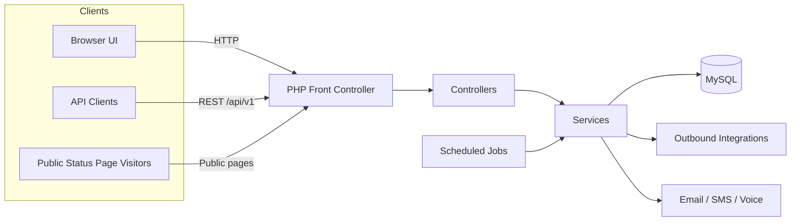
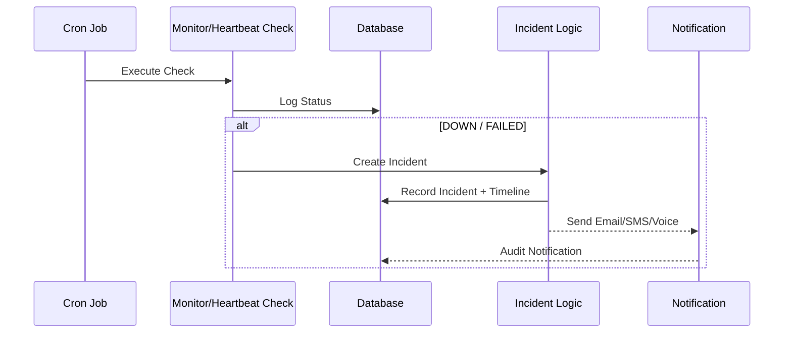
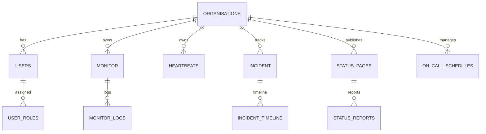

# 🛡️ SpectraEYE - Comprehensive Monitoring Platform

> **SpectraEYE** is a complete platform for **monitoring**, **incident management**, and **operational communication** (SaaS + On-Premise). It centralizes critical job monitoring, incident escalation, and team collaboration.

---

## 📑 Table of Contents

1.  [About the Project](#-about-the-project)
2.  [Key Features](#-key-features)
    *   [Monitoring](#monitoring)
    *   [Incident Management](#incident-management)
    *   [On-Call & Scheduling](#on-call--scheduling)
    *   [Status Pages](#status-pages)
3.  [Technology Stack](#-technology-stack)
4.  [System Architecture](#-system-architecture)
    *   [High-Level Overview](#high-level-overview)
    *   [Incident Logic Flow](#incident-logic-flow)
    *   [Data Model](#data-model)
5.  [Project Structure](#-project-structure)
6.  [Installation & Setup](#-installation--setup)
7.  [API Documentation](#-api-documentation)
8.  [License](#-license)

---

## 🚀 About the Project

SpectraEYE is built to ensure high availability and transparency for modern services. It provides a unified interface for:
*   Monitoring HTTP services, TCP ports, and Cron jobs (Heartbeats).
*   Managing the entire incident lifecycle from detection to post-mortem.
*   Communicating status updates to end-users via public Status Pages.
*   Orchestrating team responses with On-Call schedules and escalation policies.

---

## ✨ Key Features

### Monitoring
*   **Multi-Protocol Checks**: HTTP, Host Ping, TCP, Keyword Search (`contains`/`not_contains`).
*   **Detailed Logging**: Response times, status codes, and error tracking.
*   **Heartbeats**: Cron job monitoring with grace periods for passive checks.
*   **Maintenance Windows**: Scheduled downtime handling to prevent false alerts.

### Incident Management
*   **Full Workflow**: Create -> Acknowledge -> Resolve -> Post-Mortem.
*   **Timeline**: Detailed history of status changes, ownership updates, and comments.
*   **Smart Escalation**: Automatic escalation to higher-tier teams if unmatched.
*   **Rich Media**: Support for image and document attachments in incident records.

### On-Call & Scheduling
*   **Rotations**: Flexible on-call schedules with daily/weekly rotations.
*   **Overrides & Swaps**: Manual overrides and shift swap request workflows.
*   **API Integration**: Endpoint to query "Who is on-call now?".

### Status Pages
*   **Public Status Hub**: Customizable pages to showcase system health.
*   **Subscriptions**: End-users can subscribe via email/SMS for updates.
*   **Maintenance Announcements**: Scheduled maintenance notices.

### Integrations & Notifications
*   **Channels**: Email (SendGrid), SMS/Voice (Twilio), In-App.
*   **Chat Ops**: Internal chat, reaction support, and team-based channels.
*   **Outbound**: Slack, Discord, Microsoft Teams, Webhooks.
*   **Inbound**: Webhooks for Grafana, Prometheus, Datadog.

---

## 🛠 Technology Stack

### **Backend**
*   **Language**: [PHP 8.x](https://www.php.net/)
*   **Framework**: Custom MVP with Illuminate/Database (Eloquent)
*   **Database**: [MySQL 8.x](https://www.mysql.com/)
*   **Email**: PHPMailer + Symfony Mailer + SendGrid
*   **Voice/SMS**: Twilio SDK & Webklex IMAP

### **Frontend**
*   **Libraries**: jQuery, Chart.js (Analytics), FullCalendar (Scheduling)
*   **Editor**: Quill.js (Rich Text)
*   **Search**: Fuse.js

---

## 🏗 System Architecture

### High-Level Overview



### Incident Logic Flow
How a failed check triggers an incident.



### Data Model
Simplified Entity-Relationship Diagram.



---

## 📂 Project Structure

```bash
SpectraEYE/
├── assets/            # UI assets, JS libraries, translations
├── config/            # Database, SMTP, Twilio configurations
├── includes/          # Layout partials, language loaders
├── src/
│   ├── Controllers/   # Request handling
│   ├── Models/        # Eloquent models
│   ├── Services/      # Business logic
│   └── jobs/          # Cron scripts (monitoring logic)
├── public/            # Publicly accessible assets
├── storage/           # Logs and cache
└── index.php          # Application Entry Point
```

---

## ⚡ Installation & Setup

1.  **Requirements**: PHP 8.x, MySQL 8.x, Composer.
2.  **Install Dependencies**:
    ```bash
    composer install
    ```
3.  **Database**: Import `sql_for_databse_sql/spectra_export.sql`.
4.  **Configuration**:
    *   Rename config examples and update `config/database.php`, `config/smtp.php`.
5.  **Cron Jobs**: Set up crontabs for scripts in `src/jobs/`.

---

## 🔌 API Documentation

| Method | Endpoint | Description |
| :--- | :--- | :--- |
| `GET` | `/api/v1/health` | Public system health check |
| `GET` | `/api/v1.1/heartbeat/{id}` | Heartbeat ping endpoint |
| `GET` | `/api/v1/monitors` | List all monitors |
| `POST` | `/api/v1/incidents` | Create a new incident |

*Full OpenAPI specification available in `swagger.yaml`.*

---

## 📄 License

Distributed under the Proprietary License. See `LICENSE` for more information.

---

**Built with ❤️ by the SpectraEYE Team**
